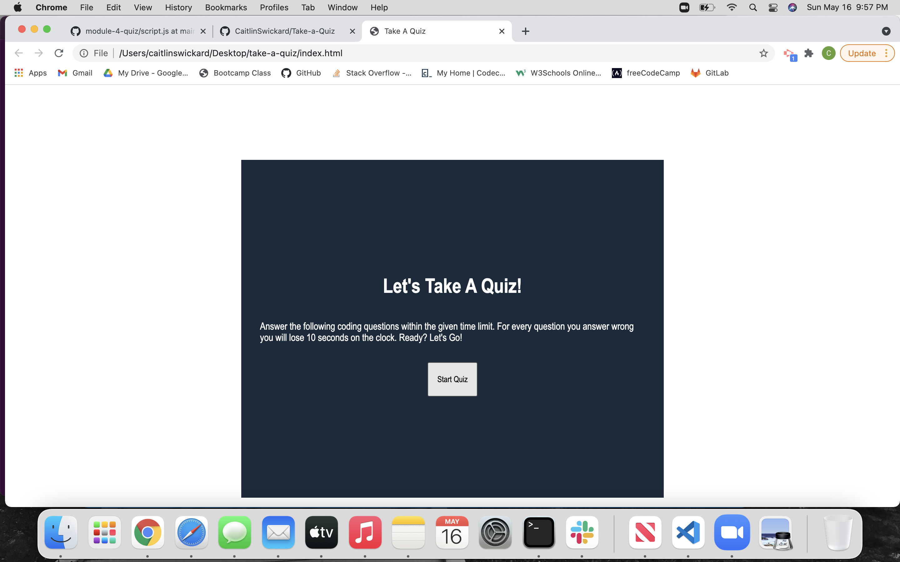
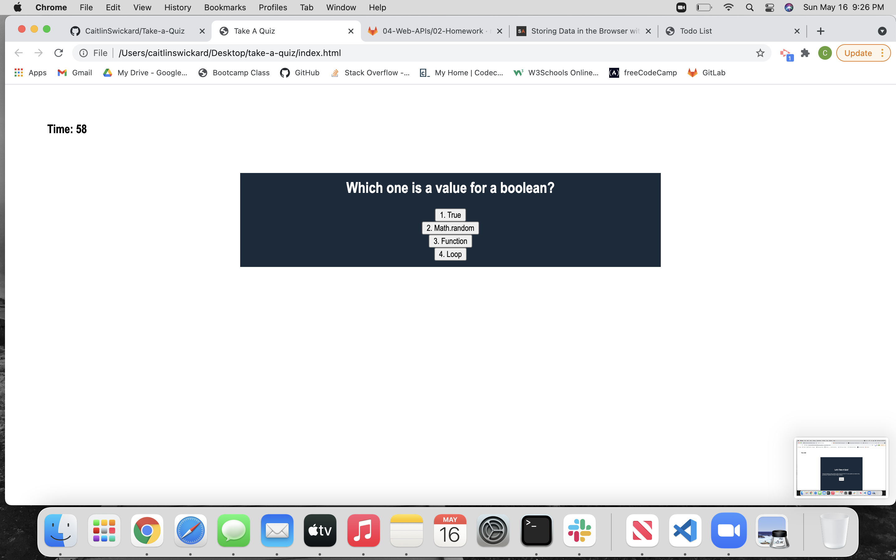
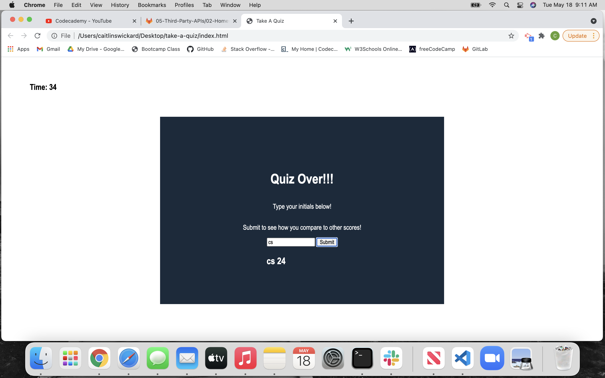

# Project: Take A Quiz

This project allows for a student to take a quiz on coding fundamental. This quiz is timed with 60 second to complete. The timer and the quiz start when the user clicks the button. The user can go through the questions one by one. If they answer a question wrong they will lose 10 second on the clock. When the quiz is over, the user is prompted to input their initials to be placed with their score, which is the time left on the clock. Once submitted you can see the previous players of the quiz.

### Criteria

- AS A coding boot camp student
- I WANT to take a timed quiz on JavaScript fundamentals that stores high scores
- SO THAT I can gauge my progress compared to my peers
- GIVEN I am taking a code quiz
- WHEN I click the start button
- THEN a timer starts and I am presented with a question
- WHEN I answer a question
- THEN I am presented with another question
- WHEN I answer a question incorrectly
- THEN time is subtracted from the clock
- WHEN all questions are answered or the timer reaches 0
- THEN the game is over
- WHEN the game is over
- THEN I can save my initials and my score

## Built With

- HTML
- CSS
- JavaScript

## Screen Shots

